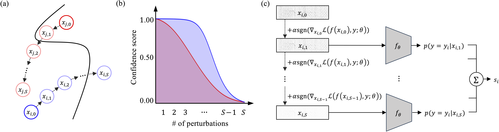
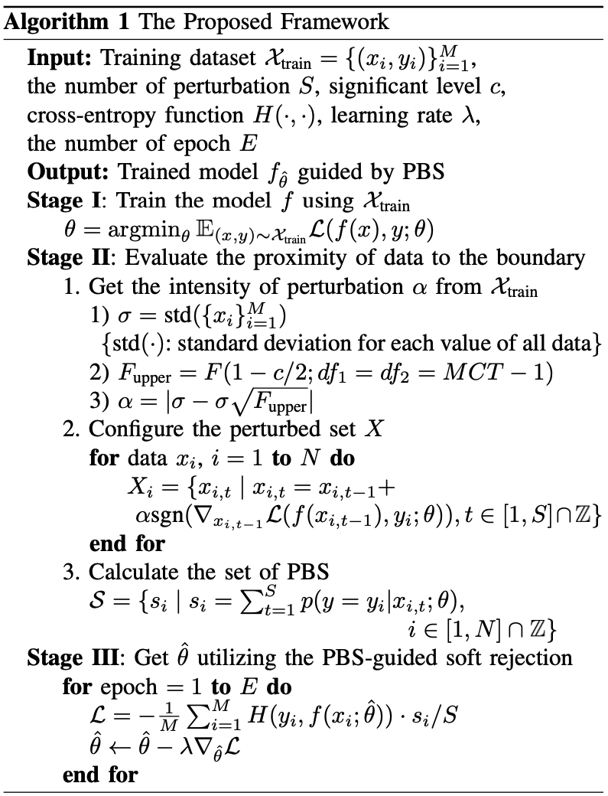
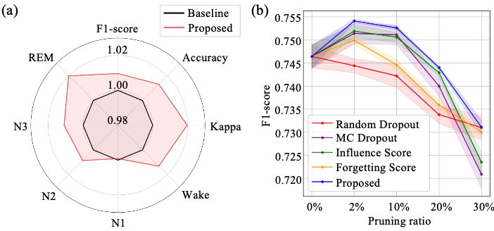
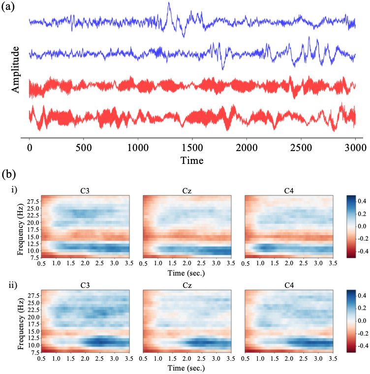
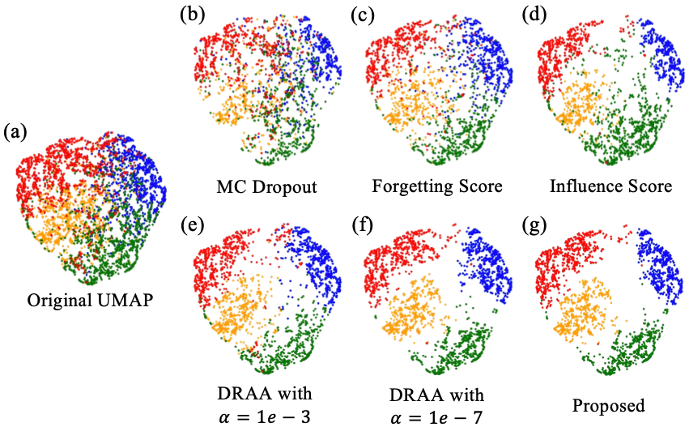

# A Novel Adversarial Approach for EEG Dataset Refinement: Enhancing Generalization through Proximity-to-Boundary Scoring

This repository is the official implementations of Proximity-to-Boundary Score in pytorch-lightning style:

```text
TBA
```

<!-- ```text
S.-J. Kim, H. Kong, D.-H. Lee, H.-G. Kwak, and S.-W. Lee, "A Novel Adversarial Approach for EEG Dataset Refinement: Enhancing Generalization through Proximity-to-Boundary Scoring," IEEE Transactions on Cybernetics, 2025. (Accepted)
``` -->

## Overall Framework



## Abstract

> As deep learning performs remarkably in pattern recognition from complex data, it is used to interpret user intentions from electroencephalography (EEG) signals. However, deep learning models trained from EEG datasets have low generalization ability owing to numerous noisy samples in datasets. Therefore, pioneer research has focused on distinguishing and eliminating noisy samples from datasets. One intuitive solution is based on the property of noisy samples during the training phase. Noisy samples are located near the decision boundary after model training. Therefore, they can be detected using a gradient-based adversarial attack. However, limitations of usability exist because the intuitive solution requires additional hyperparameter optimizations, resulting in a trade-off between accurateness and efficiency. In this paper, we proposed a novel training framework that enhances the generalization ability of the model by reducing the influence of noisy samples during training, without additional hyperparameter optimizations. We designed the proximity-to-boundary score (PBS) to continuously measure the data closeness to the decision boundary. The proposed framework improved the generalization ability of the model across two motor imagery datasets and one sleep stage dataset. We qualitatively confirmed that data with low PBS are indeed noisy samples and degrade the model training. Hence, we demonstrated that employing the proposed framework accurately and efficiently mitigates the influence of noisy samples, enhancing the model's generalization capabilities.

## Algorithm of the proposed framework

<p align="center">
  
</p>

## 1. Installation

### 1.1 Clone this repository

```bash
$ git clone https://github.com/comojin1994/proximity-to-boundary-score.git
```

### 1.2 Environment setup

> Create docker container and `databases` and `logs` directory by under script

```bash
$ cd docker
$ make start.train
$ docker exec -it torch-train bash
$ cd proximity-to-boundary-score
```

### 1.3 Preparing data

> After downloading the [BCI Competition IV 2a & 2b](https://www.bbci.de/competition/iv/#download) and [Sleep-EDF](https://physionet.org/content/sleep-edfx/1.0.0/), revise the data's directory in the `datasets/setups/{dataset}.py` files

```bash
# We provide the official code using BCI Competition IV 2a.
$ make setup
```

```python
BASE_PATH = {Dataset directory}
SAVE_PATH = {Revised dataset directory}
```

## 2. Quantitative Analysis

### 2.1 Comparison of performances in motor imagery classification datasets

<table class="tg"><thead>
  <tr>
    <th class="tg-lboi" rowspan="2"><span style="font-weight:400;font-style:normal;text-decoration:none;color:black">Method</span></th>
    <th class="tg-9wq8" colspan="3"><span style="font-weight:400;font-style:normal;text-decoration:none;color:black">BCIC2a</span></th>
    <th class="tg-nrix" colspan="3"><span style="font-weight:400;font-style:normal;text-decoration:none;color:black">BCIC2b</span></th>
  </tr>
  <tr>
    <th class="tg-9wq8"><span style="font-weight:400;font-style:normal;text-decoration:none;color:black">    EEGNet   </span></th>
    <th class="tg-9wq8"><span style="font-weight:400;font-style:normal;text-decoration:none;color:black">DeepConvNet</span></th>
    <th class="tg-nrix"><span style="font-weight:400;font-style:normal;text-decoration:none;color:black">ShallowConvNet</span></th>
    <th class="tg-nrix"><span style="font-weight:400;font-style:normal;text-decoration:none;color:black">    EEGNet   </span></th>
    <th class="tg-nrix"><span style="font-weight:400;font-style:normal;text-decoration:none;color:black">DeepConvNet</span></th>
    <th class="tg-nrix"><span style="font-weight:400;font-style:normal;text-decoration:none;color:black">ShallowConvNet</span></th>
  </tr></thead>
<tbody>
  <tr>
    <td class="tg-lboi"><span style="font-weight:400;font-style:normal;text-decoration:none;color:black">Baseline</span></td>
    <td class="tg-9wq8"><span style="font-weight:400;font-style:normal;text-decoration:none;color:black">61.51 $\pm$ 0.96</span></td>
    <td class="tg-9wq8"><span style="font-weight:400;font-style:normal;text-decoration:none;color:black">56.97 $\pm$ 0.48</span></td>
    <td class="tg-nrix"><span style="font-weight:400;font-style:normal;text-decoration:none;color:black">59.55 $\pm$ 0.75</span></td>
    <td class="tg-nrix"><span style="font-weight:400;font-style:normal;text-decoration:none;color:black">77.24 $\pm$ 0.36</span></td>
    <td class="tg-nrix"><span style="font-weight:400;font-style:normal;text-decoration:none;color:black">76.44 $\pm$ 0.22</span></td>
    <td class="tg-nrix"><span style="font-weight:400;font-style:normal;text-decoration:none;color:black">76.77 $\pm$ 0.26</span></td>
  </tr>
  <tr>
    <td class="tg-lboi"><span style="font-weight:400;font-style:normal;text-decoration:none;color:black">Random Dropout</span></td>
    <td class="tg-9wq8"><span style="font-weight:400;font-style:normal;text-decoration:none;color:black">61.79 $\pm$ 0.34</span></td>
    <td class="tg-9wq8"><span style="font-weight:400;font-style:normal;text-decoration:none;color:black">56.74 $\pm$ 0.38</span></td>
    <td class="tg-nrix"><span style="font-weight:400;font-style:normal;text-decoration:none;color:black">59.26 $\pm$ 0.54</span></td>
    <td class="tg-nrix"><span style="font-weight:400;font-style:normal;text-decoration:none;color:black">77.05 $\pm$ 0.26</span></td>
    <td class="tg-nrix"><span style="font-weight:400;font-style:normal;text-decoration:none;color:black">76.42 $\pm$ 0.16</span></td>
    <td class="tg-nrix"><span style="font-weight:400;font-style:normal;text-decoration:none;color:black">76.45 $\pm$ 0.20</span></td>
  </tr>
  <tr>
    <td class="tg-lboi"><span style="font-weight:400;font-style:normal;text-decoration:none;color:black">MC Dropout</span></td>
    <td class="tg-9wq8"><span style="font-weight:400;font-style:normal;text-decoration:none;color:black">62.16 $\pm$ 0.56</span></td>
    <td class="tg-9wq8"><span style="font-weight:400;font-style:normal;text-decoration:none;color:black">62.24 $\pm$ 0.34</span></td>
    <td class="tg-nrix"><span style="font-weight:400;font-style:normal;text-decoration:none;color:black">63.44 $\pm$ 0.37</span></td>
    <td class="tg-nrix"><span style="font-weight:400;font-style:normal;text-decoration:none;color:black">77.27 $\pm$ 0.20</span></td>
    <td class="tg-nrix"><span style="font-weight:400;font-style:normal;text-decoration:none;color:black">79.55 $\pm$ 0.07</span></td>
    <td class="tg-nrix"><span style="font-weight:400;font-style:normal;text-decoration:none;color:black">78.58 $\pm$ 0.27</span></td>
  </tr>
  <tr>
    <td class="tg-lboi"><span style="font-weight:400;font-style:normal;text-decoration:none;color:black">Influence Score</span></td>
    <td class="tg-9wq8"><span style="font-weight:400;font-style:normal;text-decoration:none;color:black">62.48 $\pm$ 1.18</span></td>
    <td class="tg-9wq8"><span style="font-weight:400;font-style:normal;text-decoration:none;color:black">61.64 $\pm$ 1.01</span></td>
    <td class="tg-8b8f"><span style="font-weight:400;font-style:normal;text-decoration:underline;color:black">64.09 $\pm$ 0.67</span></td>
    <td class="tg-8b8f"><span style="font-weight:400;font-style:normal;text-decoration:underline;color:black">78.66 $\pm$ 0.17</span></td>
    <td class="tg-wa1i"><span style="font-weight:700;font-style:normal;text-decoration:none;color:black">80.34 $\pm$ 0.03</span></td>
    <td class="tg-nrix"><span style="font-weight:400;font-style:normal;text-decoration:none;color:black">80.20 $\pm$ 0.19</span></td>
  </tr>
  <tr>
    <td class="tg-lboi"><span style="font-weight:400;font-style:normal;text-decoration:none;color:black">Forgetting Score</span></td>
    <td class="tg-9wq8"><span style="font-weight:400;font-style:normal;text-decoration:none;color:black">61.85 $\pm$ 0.78</span></td>
    <td class="tg-9wq8"><span style="font-weight:400;font-style:normal;text-decoration:none;color:black">59.62 $\pm$ 0.01</span></td>
    <td class="tg-nrix"><span style="font-weight:400;font-style:normal;text-decoration:none;color:black">60.09 $\pm$ 0.55</span></td>
    <td class="tg-nrix"><span style="font-weight:400;font-style:normal;text-decoration:none;color:black">77.89 $\pm$ 0.25</span></td>
    <td class="tg-nrix"><span style="font-weight:400;font-style:normal;text-decoration:none;color:black">80.28 $\pm$ 0.01</span></td>
    <td class="tg-nrix"><span style="font-weight:400;font-style:normal;text-decoration:none;color:black">77.40 $\pm$ 0.29</span></td>
  </tr>
  <tr>
    <td class="tg-lboi"><span style="font-weight:400;font-style:normal;text-decoration:none;color:black">DRAA</span></td>
    <td class="tg-9wq8"></td>
    <td class="tg-9wq8"></td>
    <td class="tg-nrix"></td>
    <td class="tg-nrix"></td>
    <td class="tg-nrix"></td>
    <td class="tg-nrix"></td>
  </tr>
  <tr>
    <td class="tg-lboi"><span style="font-weight:400;font-style:normal;text-decoration:none;color:black">$\alpha = \text{1e-3}$</span></td>
    <td class="tg-9wq8"><span style="font-weight:400;font-style:normal;text-decoration:none;color:black">63.54 $\pm$ 0.95</span></td>
    <td class="tg-9wq8"><span style="font-weight:400;font-style:normal;text-decoration:none;color:black">56.71 $\pm$ 0.42</span></td>
    <td class="tg-nrix"><span style="font-weight:400;font-style:normal;text-decoration:none;color:black">60.90 $\pm$ 0.71</span></td>
    <td class="tg-nrix"><span style="font-weight:400;font-style:normal;text-decoration:none;color:black">78.27 $\pm$ 0.35</span></td>
    <td class="tg-nrix"><span style="font-weight:400;font-style:normal;text-decoration:none;color:black">79.45 $\pm$ 1.06</span></td>
    <td class="tg-nrix"><span style="font-weight:400;font-style:normal;text-decoration:none;color:black">79.25 $\pm$ 0.18</span></td>
  </tr>
  <tr>
    <td class="tg-cly1"><span style="font-weight:400;font-style:normal;text-decoration:none;color:black">$\alpha = \text{1e-5}$</span></td>
    <td class="tg-nrix"><span style="font-weight:400;font-style:normal;text-decoration:none;color:black">63.91 $\pm$ 0.35</span></td>
    <td class="tg-nrix"><span style="font-weight:400;font-style:normal;text-decoration:none;color:black">62.16 $\pm$ 0.54</span></td>
    <td class="tg-nrix"><span style="font-weight:400;font-style:normal;text-decoration:none;color:black">62.70 $\pm$ 0.40</span></td>
    <td class="tg-nrix"><span style="font-weight:400;font-style:normal;text-decoration:none;color:black">78.35 $\pm$ 0.14</span></td>
    <td class="tg-nrix"><span style="font-weight:400;font-style:normal;text-decoration:none;color:black">79.80 $\pm$ 0.22</span></td>
    <td class="tg-nrix"><span style="font-weight:400;font-style:normal;text-decoration:none;color:black">80.03 $\pm$ 0.21</span></td>
  </tr>
  <tr>
    <td class="tg-cly1"><span style="font-weight:400;font-style:normal;text-decoration:none;color:black">$\alpha = \text{1e-7}$</span></td>
    <td class="tg-8b8f"><span style="font-weight:400;font-style:normal;text-decoration:underline;color:black">64.68 $\pm$ 0.43</span></td>
    <td class="tg-8b8f"><span style="font-weight:400;font-style:normal;text-decoration:underline;color:black">62.59 $\pm$ 0.14</span></td>
    <td class="tg-nrix"><span style="font-weight:400;font-style:normal;text-decoration:none;color:black">63.35 $\pm$ 1.16</span></td>
    <td class="tg-nrix"><span style="font-weight:400;font-style:normal;text-decoration:none;color:black">78.62 $\pm$ 0.33</span></td>
    <td class="tg-nrix"><span style="font-weight:400;font-style:normal;text-decoration:none;color:black">80.27 $\pm$ 0.18</span></td>
    <td class="tg-wa1i"><span style="font-weight:700;font-style:normal;text-decoration:none;color:black">80.98 $\pm$ 0.29</span></td>
  </tr>
  <tr>
    <td class="tg-yla0"><span style="font-weight:700;font-style:normal;text-decoration:none;color:black">Proposed</span></td>
    <td class="tg-wa1i"><span style="font-weight:700;font-style:normal;text-decoration:none;color:black">64.90 $\pm$ 0.46</span></td>
    <td class="tg-wa1i"><span style="font-weight:700;font-style:normal;text-decoration:none;color:black">62.67 $\pm$ 0.47</span></td>
    <td class="tg-wa1i"><span style="font-weight:700;font-style:normal;text-decoration:none;color:black">64.31 $\pm$ 1.00</span></td>
    <td class="tg-wa1i"><span style="font-weight:700;font-style:normal;text-decoration:none;color:black">78.67 $\pm$ 0.23</span></td>
    <td class="tg-8b8f"><span style="font-weight:400;font-style:normal;text-decoration:underline;color:black">80.31 $\pm$ 0.14</span></td>
    <td class="tg-8b8f"><span style="font-weight:400;font-style:normal;text-decoration:underline;color:black">80.41 $\pm$ 0.16</span></td>
  </tr>
</tbody></table>

### 2.2 Comparison of performances in sleep stage classification datasets

<p align="center">
  
</p>

### 2.3 Comparison of efficiency

<table class="tg"><thead>
  <tr>
    <th class="tg-0pky">Method</th>
    <th class="tg-c3ow">Complexity</th>
    <th class="tg-c3ow">$\tau$ opt.</th>
    <th class="tg-c3ow">GPU Min.</th>
  </tr></thead>
<tbody>
  <tr>
    <td class="tg-0pky">Influence Score</td>
    <td class="tg-c3ow">$\mathcal{O}(ME+Mp^2+p^3+M^2p^2)$</td>
    <td class="tg-c3ow">✓</td>
    <td class="tg-c3ow">116.63</td>
  </tr>
  <tr>
    <td class="tg-0pky">MC Dropout</td>
    <td class="tg-c3ow">$\mathcal{O}(ME+MS_\text{MC}f)$</td>
    <td class="tg-c3ow">✓</td>
    <td class="tg-c3ow">0.42</td>
  </tr>
  <tr>
    <td class="tg-0pky">Forgetting Score</td>
    <td class="tg-c3ow">$\mathcal{O}(ME)$</td>
    <td class="tg-c3ow">✓</td>
    <td class="tg-c3ow">-</td>
  </tr>
  <tr>
    <td class="tg-0pky">DRAA</td>
    <td class="tg-c3ow"></td>
    <td class="tg-0pky"></td>
    <td class="tg-0pky"></td>
  </tr>
  <tr>
    <td class="tg-0pky">$\alpha = \text{1e-3}$</td>
    <td class="tg-c3ow">$\mathcal{O}(ME+M\bar{S}_\text{1e-3}f)$</td>
    <td class="tg-c3ow">✓</td>
    <td class="tg-c3ow">0.05</td>
  </tr>
  <tr>
    <td class="tg-0pky">$\alpha = \text{1e-5}$</td>
    <td class="tg-c3ow">$\mathcal{O}(ME+M\bar{S}_\text{1e-5}f)$</td>
    <td class="tg-c3ow">✓</td>
    <td class="tg-c3ow">6.2</td>
  </tr>
  <tr>
    <td class="tg-0pky">$\alpha = \text{1e-7}$</td>
    <td class="tg-c3ow">$\mathcal{O}(ME+M\bar{S}_\text{1e-7}f)$</td>
    <td class="tg-c3ow">✓</td>
    <td class="tg-c3ow">839.15</td>
  </tr>
  <tr>
    <td class="tg-0pky">Proposed</td>
    <td class="tg-c3ow">$\mathcal{O}(ME+MSf)$</td>
    <td class="tg-c3ow">𐄂</td>
    <td class="tg-c3ow">1.48</td>
  </tr>
</tbody></table>

## 3. Qualitative Analysis

### 3.1 Signal visualization

<p align="center">
  
</p>

### 3.2 Feature visualization

<p align="center">
  
</p>

## 4. User Manual

### STAGE 1: Training model $f$ using $X_{train}$

```yaml
# config.yaml

mode: "all"

litmodel: "base"

...

score: null

...

weighted_loss: False

```

```bash
$ make train
```

### STAGE 2: Evaluate the proximity of data to the boundary

> Run `evaluation.ipynb` jupyter notebook

> Revise the options in config files

```python
# Block [2] in evaluation.ipynb

args = get_configs()
args = init_configs(args)
init_settings(args)

args.WEIGHT_PATH = "{checkpoint path}"
```

### STAGE 3: Get $\hat{\theta}$ utilizing PBS-guided soft rejection

```yaml
# config.yaml

mode: "cls"

litmodel: "weighted"

...

score: "pbs"

...

weighted_loss: True

```

```bash
$ make train
```
